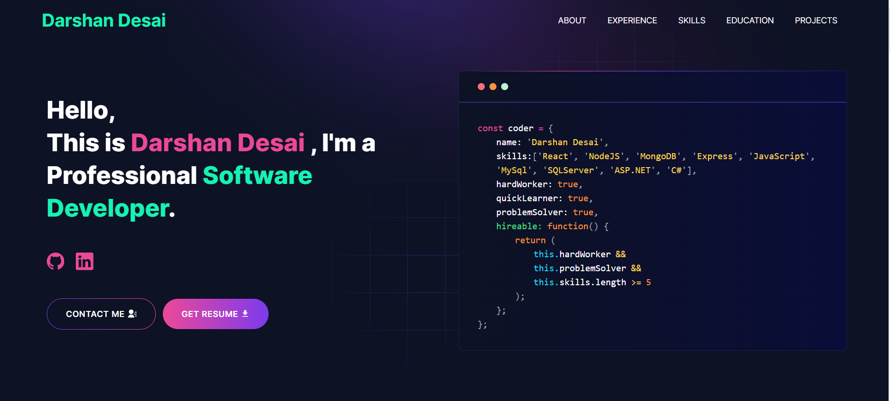

# Developer Portfolio

### Are you struggling to create a professional portfolio website? Look no further! You can use the Developer Portfolio template and create your very own personalized portfolio today! My website is designed to be user-friendly and easily customizable, making it perfect for both developers and freelancers.

---

# Demo 🎥



## View live preview [here](https://darshandesai.netlify.app/).

---

## Table of Contents 📜

- [Sections](#sections-bookmark)
- [Demo](#demo-movie_camera)
- [Installation](#installation-arrow_down)
- [Getting Started](#getting-started-dart)
- [Usage](#usage-joystick)
- [Packages Used](#packages-used-package)

---

# Sections 🔖

- HERO SECTION
- ABOUT ME
- EXPERIENCE
- SKILLS
- PROJECTS
- EDUCATION
- CONTACTS

---

# Installation ⬇️

### You will need to download Git and Node to run this project

- [Git](https://git-scm.com/downloads)
- [Node](https://nodejs.org/en/download/)

#### Make sure you have the latest version of both Git and Node on your computer.

```bash
node --version
git --version


# Getting Started with Developer Portfolio 🎯

Fork and Clone the repo

To Fork the repo click on the fork button at the top right of the page. 
Once the repo is forked open your terminal and perform the following commands

```bash
git clone https://github.com/<YOUR GITHUB USERNAME>/developer-portfolio.git

cd developer-portfolio

Install packages from the root directory
npm install
# or
yarn install

Then, run the development server:
npm run dev
# or
yarn dev

Open http://localhost:3000 with your browser to see the result.


Usage 🕹️
Goto emailjs.com and create a new account for the mail sending. In free trial you will get 200 mail per month. 
After setup emailjs account, Please create a new .env file from .env.example file.

Eg:
NEXT_PUBLIC_EMAILJS_SERVICE_ID =
NEXT_PUBLIC_EMAILJS_TEMPLATE_ID =
NEXT_PUBLIC_EMAILJS_PUBLIC_KEY =
NEXT_PUBLIC_GTM = # For site analytics
NEXT_PUBLIC_APP_URL = "http://127.0.0.1:3000"
NEXT_PUBLIC_RECAPTCHA_SECRET_KEY = # For captcha verification on contact form
NEXT_PUBLIC_RECAPTCHA_SITE_KEY =

Then, Customize data in the utils/data folder.
Eg:
export const personalData = {
  name: "your name",
  profile: "/profile.png",
  designation: "Full-Stack Software Developer",
  description: "My name is Name....",
  email: "email@gmail.com",
  phone: "+91 0000000XXX",
  address: "your address ",
  github: "https://github.com/username",
  facebook: "https://www.facebook.com/username/",
  linkedIn: "https://www.linkedin.com/in/username/",
  twitter: "https://twitter.com/username",
  stackOverflow: "https://stackoverflow.com/username",
  leetcode: "https://leetcode.com/username/",
  devUsername: "username",
  resume: "your google drive link",
};
devUsername Used for fetching blog from dev.to.

Packages Used 📦

Used Package List
next
@emailjs/browser
lottie-react
react-fast-marquee
react-icons
react-toastify
sass
tailwindcss
